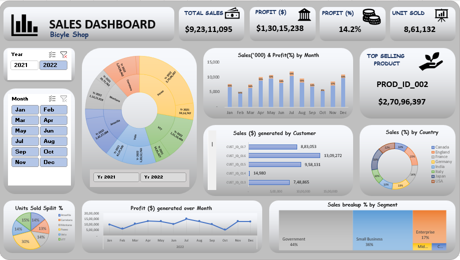

# 📊 Business Sales Dashboard (Excel-Based)

A professional, interactive Excel dashboard designed to visualize key sales performance metrics in a user-friendly and insightful format. This dashboard combines raw data analysis, pivot tables, and graphical summaries for enhanced business intelligence.

---
> ✨ Empowering minds. One thought at a time.

---
## 📸 UI Preview

>   

---

## 🎯 Objectives

- Provide business stakeholders with a *clear and concise summary* of sales performance.
- Enable *data-driven decision-making* with visual insights.
- Help teams *identify patterns, trends, and outliers* using dynamic filters and visualizations.
- Offer a *self-service tool* that eliminates the need for manual reporting.

---

## 🧩 Key Features

### ✅ Dashboard Highlights
- *Total Revenue & Sales Volume* KPIs
- *Monthly Sales Trendline*
- *Sales by Region & Product Category*
- *Top Performing Products*
- *Customer Segmentation*
- *Sunburst Chart* for hierarchical analysis

### 📌 Built-in Functionalities
- *Interactive Slicers*: Filter by Month, Region, and Category
- *Pivot Tables*: Backend aggregation for real-time analysis
- *Dynamic Charts*: Automatically respond to filters
- *Conditional Formatting*: Highlights key figures and thresholds
- *Automated Refresh Logic*: Data updates ripple through all views

---

## 📁 Project Structure

bash
📦 Dashboard Project
├── Sales Data_Dashboard.xlsx          # Main Excel dashboard file
├── README.md                # Project documentation
└── dashboard_preview.png              # Dashboard screenshot (to be added)

## 🛠 Technologies Used

- *Microsoft Excel* (Recommended version: 2016 or later)

- Pivot Tables & Pivot Charts

- Slicers for Interactivity

- Sunburst Visuals

- Conditional Formatting

- Formulas & Named Ranges

- Data Validation

---

## 🔍 How It Works

1. *Raw Sales Data Entry*  
   Input data in the Sales Data sheet.  
   Typical columns include: Date, Region, Product, Units Sold, Revenue, etc.

2. *Automated Pivot Table Analysis*  
   The Pivot Table sheet processes the raw data and structures it into key metrics.

3. *Dashboard Visualization*  
   The Dashbord sheet contains charts, KPIs, and slicers dynamically linked to pivot tables.

4. *Sunburst Chart*  
   The Sunburst sheet showcases multi-level categorical analysis (e.g., Region → Product → Category).

  ---
  ## 👤 Intended Users
- *Sales Managers* – Monitor targets vs achievements.

- *Marketing Analysts* – Assess product and regional performance.

- *Executives* – Gain high-level summaries and trends.

- *Finance Teams* – Analyze revenue streams and cost contributors.

  ---

  ## 🌟 Benefits
- *💼 Time-Saving* – Reduces dependency on manual reporting.

- *📊 Clarity* – Converts raw data into visual insights.

- *🔄 Scalability* – Easily expandable with new data points.

- *💾 Portability* – Fully offline, no external apps needed.

---

## ✅ Best Practices
- Maintain consistent naming conventions in your Sales Data sheet.

- Avoid deleting or modifying pivot table structure manually.

- Always refresh pivot tables after updating data.

- Back up your .xlsx file before major changes.

  ---

  ## ❓ FAQs
- *Q1: Can I add more regions or product categories?*
- Absolutely! Add them to the Sales Data sheet. Pivot tables and charts will update after you refresh.

- *Q2: What Excel version is required?*
- Microsoft Excel 2016 or later is recommended to fully support slicers and sunburst charts.

- *Q3: Can this connect to an external database?*
- This version is standalone. For external data, you can connect via Power Query or import CSV files.

---

## 🚀 Getting Started

1. *Download* or *clone* this project repository.
2. Open Dashbord 2.xlsx in *Microsoft Excel*.
3. Explore the following sheets:
   - Sales Data
   - Pivot Table
   - Dashbord
   - Sunburst
4. Use *slicers* to filter the dashboard by:
   - Time period
   - Region
   - Product category
5. To update the dashboard with new data:
   - Add new rows in the Sales Data sheet.
   - Right-click on any pivot table and select *Refresh All*.

---

## 🔒 Data Privacy
- This project is 100% Excel-based and offline.
- Your data never leaves your local environment unless you choose to share it.

---

## 📧 Contact
- Author: Shyam Kumar Soni
- 📧 Gmail: piyush.soni8877@gmail.com

---

## 🏷 Tags

#ExcelDashboard #SalesPerformance #InteractiveReport #BusinessIntelligence #DataVisualization #PivotTable #SunburstChart
